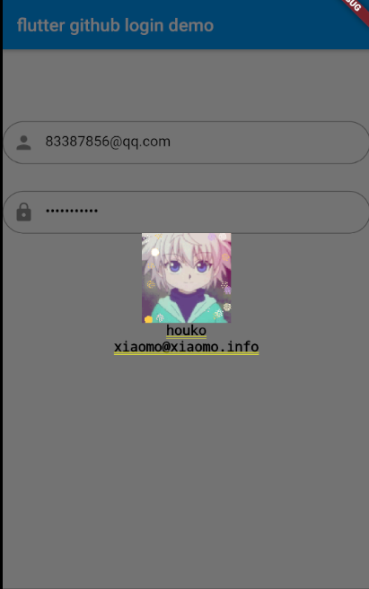

# flutter github api
[](https://pub.dartlang.org/packages/flutter_github_api)

flutter github v3 api library based on github.dart   

# api extension
- get authorization
- third part login
- get token

# getting start
```yaml
dependencies:
  github: ^0.2.0
```


# usage
1. third part login

```dart
    import 'package:flutter_github_api/flutter_github_api.dart';
    import 'package:flutter_github_api/entity/result.dart';
    User user;

    login(String username,String password){
    	// how to get clientId and clientSecret please visit https://github.com/settings/apps/new
        Auth auth = Auth('your clientId', 'your clientSecret');
        GithubOauth oauth = GithubOauth(auth);
        oauth.login(username,password).then((result){
        	if(result.data == null){
        		// 1. this means your clientId or clientSecret is error
        		// 2. this means your username or password is error
        		// 3. detail information please see result.code and result.message
        	} else {
        		setState((){
        		  this.user = result.data;
        		});
        	}
        });
    }
```


2. get token

```dart
  import 'package:flutter_github_api/flutter_github_api.dart';
  import 'package:flutter_github_api/entity/result.dart';
  
    String token='';
    getToken(String username,String password){
	    GithubOauth oauth = GithubOauth(auth);
	    oauth.login(username,password).then((result){
            if(result.data == null){
                // 1. this means your clientId or clientSecret is error
                // 2. this means your username or password is error
                // 3. detail information please see result.code and result.message
            } else {
                setState((){
                  this.token = result.data;
                });
            }
        });
    }
```

3. new issue
```dart
    import 'package:flutter_github_api/flutter_github_api.dart';
    
    void main() {
    	// how to get the token please see No2
      GitHub github = createGitHubClient(auth:  Authentication.withToken(token));
      RepositorySlug slug = RepositorySlug("flutter_jp", "flutter_github_api");
      GithubIssueRequest issue = GithubIssueRequest('just a test');
      github.issues.create(slug, issue);
    }
```


# image



# detail 
please visit [github.dart](https://github.com/SpinlockLabs/github.dart)

# license
[MIT](LICENSE)